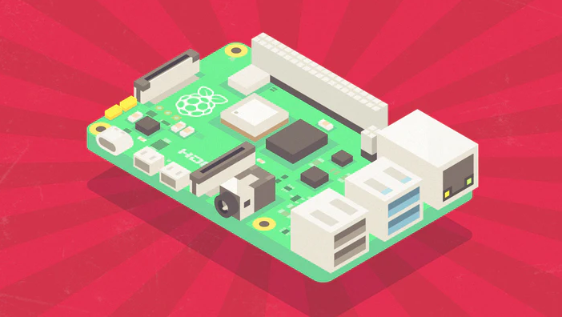
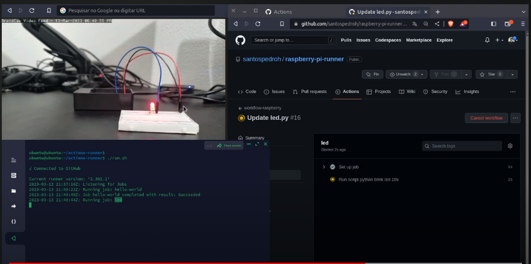

# Raspberry Pi como runner do GitHub Action

## Raspberry Pi 🖱️ + GitHubActions 🤖
Estamos em 2023, o carnaval já passou e agora estou retomando meus estudos e laboratórios. Essa semana eu tive a ideia de utilizar o _"Home Server"_ que no caso é um [Raspberry Pi](https://www.raspberrypi.com/) que eu utilizo para estudar como um Runner para processos de CI/CD com o GitHubActions.

## Exemplo prático 💡

Já que agora já temos um runner instalado e configurado no Raspberry Pi para executar os jobs do GitHub Actions tive a ideia de fazer o deploy de um programinha em python para piscar um led utilizando as portas GPIO do Raspberry Pi.

### Veja o resultado final no YouTube

](https://www.youtube.com/watch?v=_tl1sIPXpPo){:target="_blank"}
